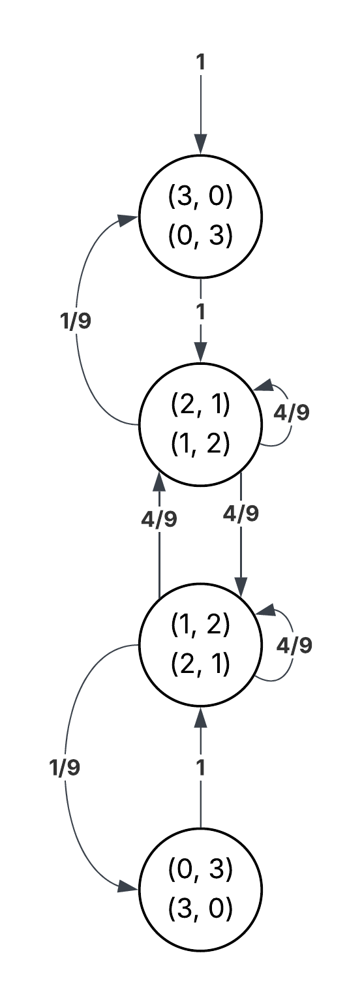

# Advanced Math Problems
## Introduction 
A repository of problems in advanced mathematics, covering topics such as formal logic, number theory, and stochastic modeling with Markov chains.

## Table of contents 
- [Introduction](#introduction)
- [Formal logic](#formal-logic)
- [Number theory](#number-theory)
- [Probability modeling](#probability-modeling)

## Formal logic

### The Eight Queens Problem
Consider the generalized Eight queens problem, i.e., the problem generalized to a chessboard of the size N x N and N queens, for a natural number N. Encode the generalized problem into a propositional formula that is satisfiable iff (if and only if) the problem has a solution, and a model of the formula encodes the solution. Write a computer program (in a language of your preference, although I suggest to use a scripting language such as Python in order to do it quickly) that outputs a CNF formula encoding the problem. The parameter N should be the single input argument. The CNF formula should be output in the DIMACS format. Use variable numbers for cells in a sequence, starting from the upper left corner, going first to the right and then down. That is, variables number 1 to N represent cells in the first row (left to right), variables number N+1 to 2N represent cells in the second row, etc. See below for N = 8.

Solution via script: [QueensProblem.py](./FormalLogic/QueensProblem.py) $\newline$
Solution via SMT solver: [QueensProblem.smt](./FormalLogic/QueensProblem.smt)

## Number theory

### Superdivisor infinite summation
Find all natural numbers `n` such that the following equality holds:
where:

- `d(0) = d(1) = 0`
- for `k > 1`, `d(k)` is the **superdivisor** of `k` (i.e., its greatest proper divisor, meaning the largest divisor `d` such that `d < k`)

Solution via script: [SuperdivisorSum.py](./NumberTheory/SuperdivisorSum.py)    $\newline$
Formal solution: [SuperdivisorSolution.md](./NumberTheory/SuperdivisorSolution.md)

### Prime remainder problem
When a certain natural number is divided by 20 and by 25, the remainders are prime numbers.  
The sum of the two incomplete quotients is equal to 2025.  
Determine the number being divided.  
Find all possible solutions.

I have found formal solution to the generalized version of this problem. $\newline$
Formal Solution: [PrimeRemainderGeneralSolution.md](./NumberTheory/PrimeRemainderGeneralSolution.md) $\newline$
Script for computing the solution: [PrimeRemainder.py](./NumberTheory/PrimeRemainder.py)

## Probability modeling

### Urns with balls problem

Suppose we have two
urns: the left one contains three white balls and the right one contains three
black balls. At each discrete time, two random balls are switched between
the urns. Let $c_0$ be the configuration when there are no white balls in the left
urn.

- Markov's model :

  

The limiting distribution of the DMTC :

1. We construct a matrix that holds from  
$$
\begin{bmatrix}
0 & \dfrac{1}{9} & 0 & 0 \\ \\
1 & \dfrac{4}{9} & \dfrac{4}{9} & 0 \\ \\
0 & \dfrac{4}{9} & \dfrac{4}{9} & 1 \\ \\
0 & 0 & \dfrac{1}{9} & 0    \\
\end{bmatrix}
$$
2. We compute limiting probability for each state as follows:

$$
\pi_0 = \frac{1}{9} \pi_1
$$
$$
\pi_1 = \pi_0 + \frac{4}{9} \pi_1 + \frac{4}{9} \pi_2 
$$
$$
\pi_2 = \pi_3 + \frac{4}{9} \pi_1 + \frac{4}{9} \pi_2  
$$
$$
\pi_3 = \frac{1}{9} \pi_2
$$
$$
\pi_0 + \pi_1 + \pi_2 + \pi_3  = 1   
$$

Resulting in :

$$
\pi_0 = \pi_3 = \frac{1}{20}
$$
$$
\pi_1 = \pi_2 = \frac{8}{20}
$$

### Coin toss with p probability problem
Design a protocol that uses a coin with
unknown bias p (probability of heads) to simulate a toss of a fair coin.

- Markov's model :

  

- Script to simulate the behaviour in according to the DTMC
    - [CoinToss.py](./ProbabilityModeling/CoinToss.py)

- Formal proof :
We start the DTMC with probabilty 1 in state $c_0$, then we go onto states $c_1$ with probability $p$ and to $c_2$ with probability $1-p$ then we either return to state $c_0$ with probability $p^2 + (1-p)^2$ or we conclude heads or tails both with probability $p(1-p)$ ... $\newline$
We can also compute the limiting distribution
$$
\begin{bmatrix}
0 & p & 1-p & 0 & 0 \\
p & 0 & 0 & 0 & 0   \\
1-p & 0 & 0 & 0 & 0 \\
0 & 1-p & 0 & 0 & 0 \\
0 & p & 0 & 0 & 0 \\
\end{bmatrix}
$$
Following the same principles as before we compute that the $p\in \left\{ 0,1 \right\}$ which results the limiting distribution to be: 
$\newline$
For $p=0$    
$$
\pi_0 = 1/2 \newline
\pi_1 = 0   \newline
\pi_2 = 0   \newline
\pi_3 = 1/2 \newline
\pi_4 = 0   \newline
$$

For $p=1$    
$$
\pi_0 = 1/2 \newline
\pi_1 = 0   \newline
\pi_2 = 0   \newline
\pi_3 = 0   \newline
\pi_4 = 1/2 \newline
$$

Thus we can conclude that the DTMC is in the state $c_0$ and $c_3$ or $c_0$ and $c_4$, both with 50% probability achieving the regular coin behaviour.